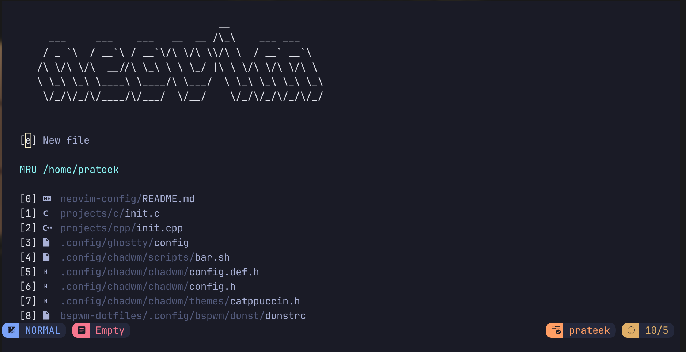

A personalized Neovim setup built on NvChad, featuring a sleek development environment with powerful plugins. I have also included some scripts to make everything faster and automate basic stuff.

## Overview

This Neovim configuration is based on NvChad, providing a **fast** and **aesthetic** development experience. The setup includes custom plugins and optimizations for an enhanced coding workflow.




## What's new

Now you can use <leader>ga to get context and ask questions about the text selected in visual mode from gemini-cli 
## Features

- **Dashboard**: Alpha dashboard for a clean startup screen
- **Base Configuration**: Built on NvChad's robust lua-based framework
- **Lazy Loading**: Optimized plugin management for minimal startup time

## Scripts
I generally use more scripts but they are usually tailored for my use. Here are some of the most common ones

- **np** - This will create a new project in ~/home/projects/lang directory based on which language you choose and initialize a git repository

- **p** - Using this you can select your language and just dive into its folder of programming language. You can choose the project from there.

- **run** - This runs the file you last edited.

> Note that this is only for c, c++, rust and python. You can edit it to serve your needs

## Installation

Clone the repository and set up the configuration:

```bash
git clone https://github.com/prateekshukla1108/neovim-config.git ~/.config/nvim
```

## Plugins

### Key Plugins
- **Dashboard**: Alpha
- **Base Framework**: NvChad

## Customization

Customize the configuration by creating a `custom` module in `lua/custom/` directory. You can add:
- Extra language server configurations
- Additional plugins
- Custom keymappings

## Requirements

- Neovim 0.9.1+
- Lazy.nvim plugin manager
- Git

## License

MIT License

